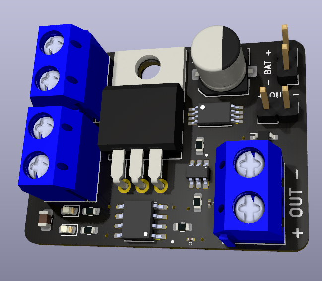
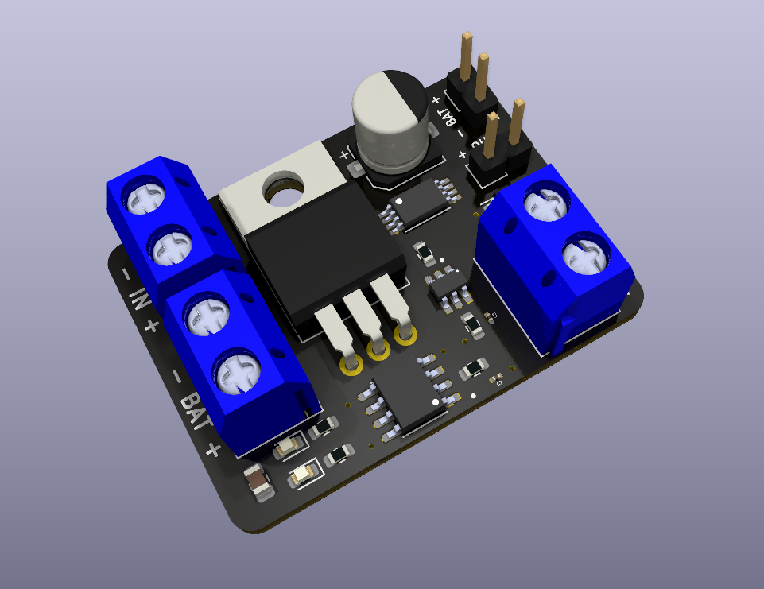
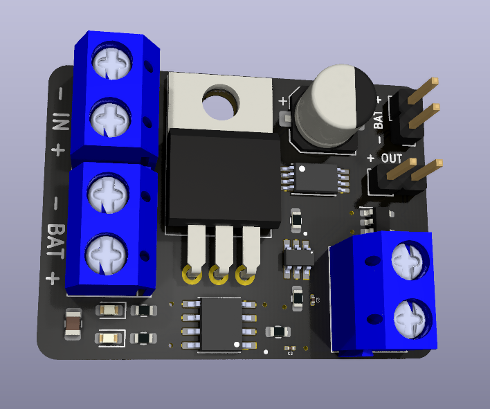

# Teste Técnico para a vaga de Desenvolvedor de Sistemas Eletrônicos Embarcados na Salvus

## Descrição

Este repositório contém minhas respostas para o teste técnico para a vaga de Desenvolvedor de Sistemas Eletrônicos Embarcados na Salvus.

O arquivo [Teste Técnico](Teste_Técnico-Lucas_Rayan_Guerra_da_Silva.pdf) contém a descrição e as questões do teste técnico, assim como as minhas respostas para as questões 2, 3, 4 e 5.

A pasta [Projeto](Projeto) contém os arquivos do projeto do circuito de fonte de alimentação regulada para um microcontrolador de baixa potência que opera com 3.3V a partir de uma fonte de 12V e/ou uma bateria.

A pasta [Arquivos_de_Fabricação](Arquivos_de_Fabricação) contém os arquivos de fabricação do circuito de fonte de alimentação regulada.

O arquivo [Lista_de_Materiais_(BOM)](Lista_de_Materiais_(BOM).csv) contém a lista de materiais (BOM) do circuito de fonte de alimentação regulada.

O arquivo [Esquemático](Esquemático.pdf) contém o esquemático do circuito de fonte de alimentação regulada.

Por questões de tempo, não foi possível realizar a simulação do circuito de fonte de alimentação regulada, devido a utilização de componentes específicos que não são encontrados um equivalente para simulação com facilidade, não tive disposnibilidade o suficiente para catalogar todos eles. Porém, por utilizar um esquema de ligação muito semelhante ao utilizado nos módulos prontos comercializados com o chip TP4056, acredito que o circuito proposto funcione corretamente, garantindo a alternância entre a fonte de alimentação e bateria, bem como as proteções contra sobrecarga e descarga excessiva da bateria.

## Justificativa do uso dos componentes

### Conectores KF301-2P

Eles foram escolhidos por ser de fácil conexão e desconexão, além de serem baratos e fáceis de encontrar.

### Capacitor C1

Ele foi escolhido para filtrar o ruído da fonte de alimentação e garantir que a tensão de entrada do regulador de tensão seja o mais estável possível.

### LED D1

Esse LED na cor verde foi escolhido para indicar que a fonte de alimentação está conectada e funcionando.

### LED D2

Esse LED na cor vermelha foi escolhido para indicar que a bateria está sendo carregada.

### Regulador LM7805

Ele foi escolhido para regular a tensão de entrada de 12V para 5V, que é a tensão utilizada para carregar a bateria. Vale ressaltar que o regulador LM7805 aceita tensões de 7V até 20V, então o circuito pode ser alimentado com tensões de 7V até 20V.

### Regulador AP2112-3.3

Ele foi escolhido para regular a tensão de 5V vinda da fonte de alimentação, ou a tensão da bateria, para 3.3V, que é a tensão de alimentação do microcontrolador. A característica mais importante para essa aplicação é que ele é um LDO (Low Drop-Out), ou seja, ele pode ser alimentado com tensões muito próximas da tensão de saída, o que é o caso quando a bateria está sendo utilizada.

### TP4056

Ele foi escolhido para controlar a carga da bateria de lítio. Ele é um módulo de carga de bateria de lítio de 1A. Ele é muito utilizado em projetos de carregadores de bateria de lítio, por ser barato e fácil de encontrar.

### DW01A

Ele foi escolhido para proteger a bateria de lítio contra sobrecarga e descarga excessiva. Ele normalmente é utilizado em conjunto com o TP4056.

### MOSFET FS8205A

Ele foi escolhido para alternar entre a fonte de alimentação e a bateria. Ele é um MOSFET de canal duplo, e também costuma ser utilizado em conjunto com o TP4056.

### Extras

Também foram acionados 2 barramentos de 2.54mm com 2 pinos cada para facilitar a conexão da bateria e do MCU via Jumpers.

## Images

A pasta [Imagens](Imagens) contém as imagens do circuito de fonte de alimentação regulada mostradas abaixo.

Autor: Lucas Rayan Guerra da Silva

